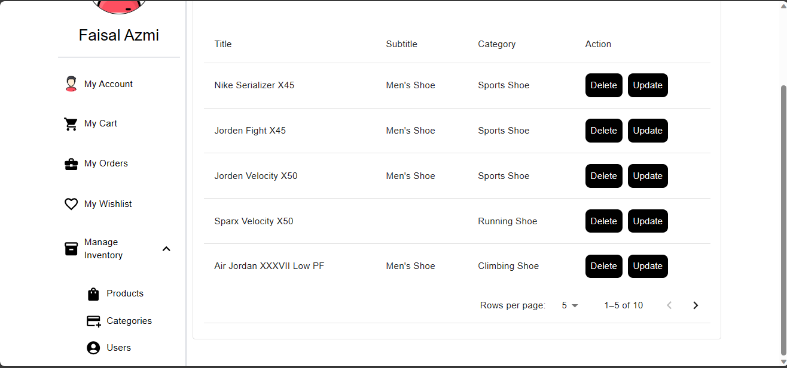

# E-SHOPIFY
This is an e-commerce shoe store from where you can find lot's of product.

## Features
- Authentication and Authorization
- Razorpay payment integration
- Search Anonymously Possible
- Add to Wishlist Anonymously Possible
- Add to Cart Anonymously Possible
- Place Order for Authenticated User
- Manage Inventory need Admin Access

## Frontend Technology Used
- React JS
- Redux toolkit for state management
- Tailwind CSS
- Redux Thunk for API Call

## Backend Technology Used
- Node JS
- Experss JS
- JWT Token for Authentication

## Project Review

- This is the **Home Page**.

- Search Page

- Product Detail Page

- Login page

- Register Page

- Cart and User Menu

- Manage Inventory Products, Category and Users

